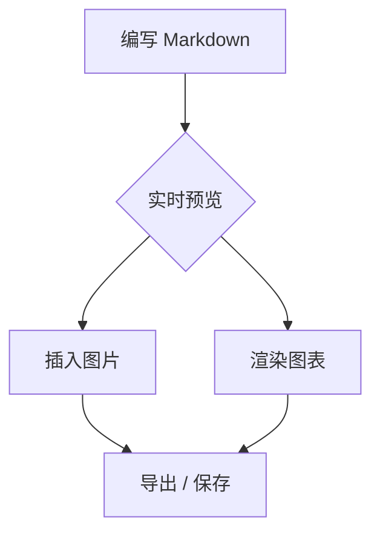
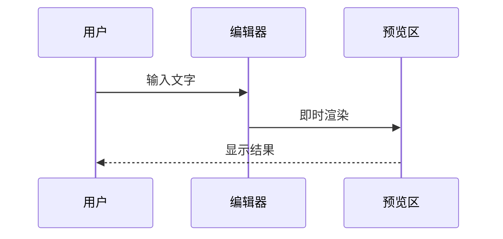
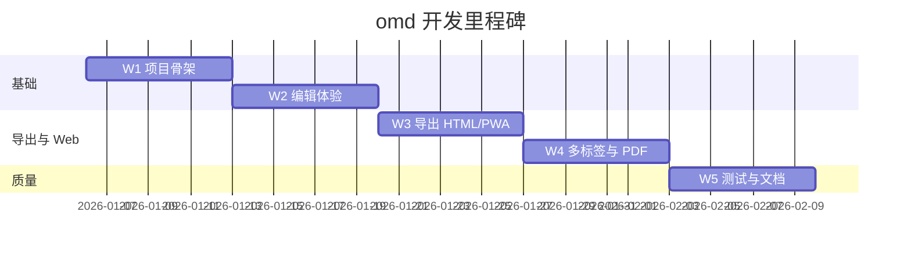
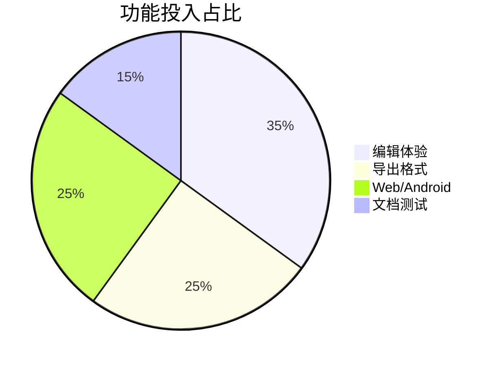
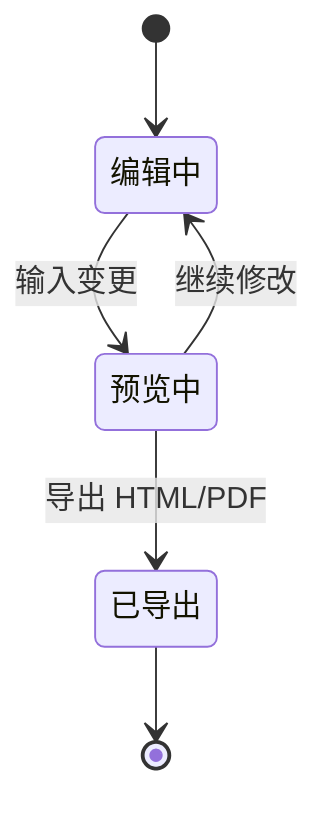
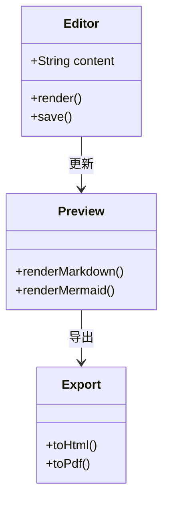
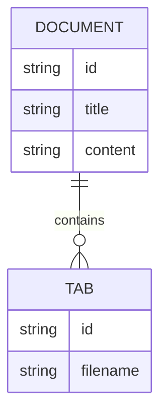

# omd 功能演示

欢迎使用 **omd** Markdown 编辑器！本文档展示常用与**复杂图表**示例，便于测试预览、主题切换与导出。

> **测试提示**：点击右上角 **🌙 / ☀️** 切换浅色/深色主题，下方甘特图、饼图等应正常重绘（无 `Syntax error`）。

---

## 1. 文本格式

| 格式 | 语法 | 效果 |
|------|------|------|
| 粗体 | `**粗体**` | **粗体** |
| 斜体 | `*斜体*` | *斜体* |
| 删除线 | `~~删除~~` | ~~删除~~ |
| 行内代码 | `` `code` `` | `code` |
| 链接 | `[文字](url)` | [Rust 官网](https://www.rust-lang.org) |

---

## 2. 任务列表

- [x] 实时预览
- [x] Mermaid 多类型图表
- [x] LaTeX 数学公式
- [x] 导出 HTML / PDF
- [ ] 继续探索…

---

## 3. 代码块

```rust
fn main() {
    println!("Hello, omd!");
}
```

---

## 4. LaTeX 数学公式

行内：$E = mc^2$，块级：

$$
\sum_{i=1}^{n} i = \frac{n(n+1)}{2}
$$

---

## 5. Mermaid — 基础图表

### 流程图



### 时序图



---

## 6. Mermaid — 复杂图表（主题切换测试）

### 甘特图（含中文任务名）



### 饼图



### 状态图



### 类图



### ER 图



---

## 7. 表格与图片

脚注示例：omd 是轻量编辑器[^note]。

[^note]: 支持桌面、Web 与 Android 三端。

| 平台 | 保存方式 |
|------|----------|
| 桌面 | 磁盘文件 |
| Web | localStorage / 下载 |
| Android | WebView + 下载 |


*点击图片可放大预览（Web / 桌面）。*

---

## 8. 快捷操作

| 功能 | 桌面 | Web |
|------|------|-----|
| 新建 | `Ctrl+N` | 顶部「新建」 |
| 保存 | `Ctrl+S` | 「下载」 |
| 查找 | `Ctrl+F` | `Ctrl+F` |
| 导出 PDF | 工具栏 📕 | 「导出 PDF」 |
| 多标签 | — | 标签栏 `+` |

---

**开始编辑吧！** 修改任意内容，预览即时更新。🦀
