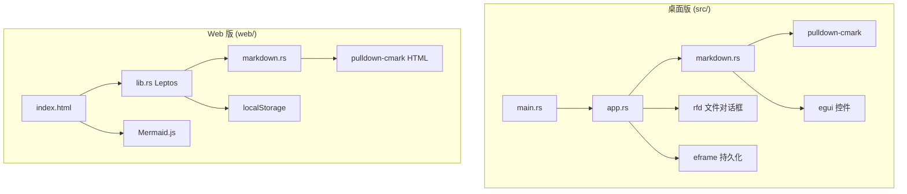

# 架构设计

本文档描述 omd 项目的技术架构、模块划分和数据流。

## 架构总览



## 总体架构

omd 由两个**独立但互补**的子项目组成：

```
┌─────────────────────────────────────────────────────────┐
│                        omd 项目                          │
├────────────────────────┬────────────────────────────────┤
│      桌面版 (根目录)      │         Web 版 (web/)          │
│                        │                                │
│  ┌──────────────────┐  │  ┌────────────┐  ┌───────────┐  │
│  │   eframe/egui    │  │  │   Leptos   │  │  Trunk    │  │
│  │   原生 GUI 层    │  │  │  WASM UI   │  │  构建工具  │  │
│  └────────┬─────────┘  │  └─────┬──────┘  └───────────┘  │
│           │            │        │                        │
│  ┌────────▼─────────┐  │  ┌─────▼──────┐                 │
│  │   app.rs         │  │  │  lib.rs    │                 │
│  │   应用逻辑/状态   │  │  │  应用逻辑   │                 │
│  └────────┬─────────┘  │  └─────┬──────┘                 │
│           │            │        │                        │
│  ┌────────▼─────────┐  │  ┌─────▼──────┐  ┌───────────┐  │
│  │  markdown.rs     │  │  │ markdown.rs│  │ Mermaid.js│  │
│  │  egui 渲染器     │  │  │ HTML 渲染器 │  │ 图表引擎   │  │
│  └────────┬─────────┘  │  └─────┬──────┘  └───────────┘  │
│           │            │        │                        │
│  ┌────────▼─────────┐  │  ┌─────▼──────┐                 │
│  │ pulldown-cmark   │  │  │pulldown-   │                 │
│  │  Event 流解析     │  │  │cmark HTML  │                 │
│  └──────────────────┘  │  └────────────┘                 │
└────────────────────────┴────────────────────────────────┘
```

两个版本**共享** pulldown-cmark 作为 Markdown 解析器，但渲染目标不同：

- 桌面版：解析 Event 流 → 渲染为 egui 原生控件
- Web 版：解析为 HTML 字符串 → 注入 DOM + Mermaid.js 后处理

## 桌面版架构

### 模块结构

```
src/
├── main.rs        # 入口：eframe 初始化、窗口配置
├── app.rs         # OmdApp：UI 布局、状态管理、文件 I/O
└── markdown.rs    # Markdown 解析与 egui 预览渲染
```

### 核心类型

#### `OmdApp`（app.rs）

应用主结构体，实现 `eframe::App` trait：

```rust
pub struct OmdApp {
    content: String,           // 编辑区文本
    file_path: Option<PathBuf>, // 当前文件路径
    modified: bool,            // 是否有未保存修改
    dark_mode: bool,           // 主题
    show_preview: bool,        // 预览区开关
    split_ratio: f32,          // 分栏比例
    status_message: String,    // 状态栏消息
    status_timer: f32,         // 消息显示计时
}
```

生命周期：

```
main() → eframe::run_native() → OmdApp::new(cc) → update() 每帧循环
                                                      ↓
                                              save() 持久化状态
```

#### `PreviewState`（markdown.rs）

Markdown 预览渲染的状态机，逐事件处理 pulldown-cmark 的 `Event` 流：

```
Parser::new_ext() → for event in parser → PreviewState::handle_event()
                                              ↓
                                    egui UI 控件（Label, Image, Grid…）
```

状态字段追踪当前解析上下文（标题级别、是否在代码块、表格行列、图片 URL 等）。

### UI 布局

```
eframe 窗口
├── TopBottomPanel::top("menu_bar")     → 菜单栏
├── TopBottomPanel::top("toolbar")      → 工具栏
├── TopBottomPanel::bottom("status_bar") → 状态栏
└── CentralPanel                        → 主内容区
    ├── 编辑区 (TextEdit::multiline)
    ├── 分隔线 (可拖拽)
    └── 预览区 (ScrollArea + render_preview)
```

### 数据流

```
用户输入 → content 更新 → modified = true
                ↓
         render_preview(content) → pulldown-cmark 解析 → egui 控件
                ↓
         Ctrl+S → write_to_path() → 写入磁盘 → modified = false
```

### 依赖关系

```
omd
├── eframe 0.29      # 应用框架（窗口、事件循环、持久化）
├── egui 0.29        # 即时模式 GUI
├── egui_extras 0.29 # 图片加载器
├── pulldown-cmark   # Markdown → Event 流
├── rfd 0.15         # 原生文件对话框
└── serde            # 状态序列化
```

## Web 版架构

### 模块结构

```
web/
├── index.html     # HTML 入口 + Mermaid.js 脚本
├── style.css      # 全局样式（主题变量、响应式）
├── Trunk.toml     # Trunk 构建配置
├── Cargo.toml     # Rust 依赖
└── src/
    ├── lib.rs     # Leptos 应用主逻辑
    └── markdown.rs # Markdown → HTML 转换
```

### 核心组件

#### Leptos 响应式状态（lib.rs）

```rust
let (content, set_content) = signal(String);      // 编辑内容
let (dark_mode, set_dark_mode) = signal(bool);     // 主题
let (view_mode, set_view_mode) = signal(ViewMode); // 视图模式
let (filename, set_filename) = signal(String);     // 文件名
let (saved_hint, set_saved_hint) = signal(bool);   // 保存提示
```

#### Effect 副作用

| Effect | 触发 | 行为 |
|--------|------|------|
| 自动保存 | content/theme/view 变化 | 写入 localStorage |
| Mermaid 渲染 | content/theme 变化 | 调用 `omdRenderMermaid()` |

#### WASM 与 JS 桥接

```rust
#[wasm_bindgen]
extern "C" {
    fn omd_render_mermaid();   // 渲染 Mermaid 图表
    fn omd_apply_theme(bool);  // 切换主题 + 重渲染图表
}
```

定义在 `index.html` 的 `<script>` 中，由 Mermaid.js 执行实际渲染。

### 渲染管线

```
Markdown 文本
    ↓
markdown_to_html()          # pulldown-cmark → HTML
    ↓
transform_mermaid_blocks()  # <pre><code class="language-mermaid"> → <div class="mermaid">
    ↓
inner_html 注入 DOM
    ↓
omdRenderMermaid()          # Mermaid.js 渲染图表
```

### 图片处理管线

```
用户操作（上传/粘贴/拖拽/URL）
    ↓
FileReader.read_as_data_url()  # 转为 Base64（上传/粘贴/拖拽）
    ↓
insert_image_into()            # 生成 
    ↓
content signal 更新
    ↓
preview_html 重新计算 → DOM 更新
```

### 构建流程

```
Trunk
├── 编译 Rust → wasm32-unknown-unknown
├── wasm-bindgen 生成 JS 胶水代码
├── wasm-opt 压缩 WASM
├── 处理 index.html（注入 hash 文件名）
├── 处理 style.css
└── 输出到 dist/
```

### 依赖关系

```
omd-web
├── leptos 0.7       # 响应式 WASM UI 框架
├── pulldown-cmark   # Markdown → HTML
├── wasm-bindgen     # Rust ↔ JS 互操作
├── web-sys          # 浏览器 API 绑定
├── js-sys           # JS 类型绑定
└── gloo-timers      # 异步定时器（保存提示）
```

## Markdown 渲染对比

| 特性 | 桌面版渲染 | Web 版渲染 |
|------|-----------|-----------|
| 引擎 | 自定义 Event 状态机 | pulldown-cmark HTML |
| 输出 | egui Label/Image/Grid | HTML 字符串 |
| 图片 | egui::Image + egui_extras | `` 标签 |
| 表格 | egui::Grid | `<table>` 标签 |
| 代码块 | 带背景色的 Label | `<pre><code>` 标签 |
| Mermaid | 不支持 | Mermaid.js |
| 链接 | ui.hyperlink_to() | `<a>` 标签 |
| 任务列表 | ☑/☐ 文本 | HTML 复选框（不可交互） |

## 状态持久化

### 桌面版

通过 eframe persistence（基于 ron 序列化）：

- 存储位置：系统应用数据目录
- 存储内容：整个 `OmdApp` 结构体
- 触发时机：应用关闭时 `save()`

### Web 版

通过浏览器 localStorage：

| 键 | 值 | 触发 |
|----|-----|------|
| `omd-web-content` | Markdown 文本 | 每次编辑 |
| `omd-web-theme` | `dark` / `light` | 主题切换 |
| `omd-web-view` | `split` / `editor` / `preview` | 视图切换 |

## 主题系统

### 桌面版

```rust
ctx.set_visuals(egui::Visuals::dark());  // 或 light()
```

egui 内置深色/浅色配色方案，影响所有控件。

### Web 版

CSS 自定义属性：

```css
:root { --bg: #f8f9fa; --text: #212529; ... }
[data-theme="dark"] { --bg: #1a1b1e; --text: #e9ecef; ... }
```

通过 `document.documentElement.setAttribute("data-theme", ...)` 切换。

## 扩展点

未来可扩展的架构位置：

| 扩展 | 建议位置 |
|------|----------|
| 新 Markdown 语法 | `markdown.rs`（两个版本） |
| 新工具栏按钮 | `app.rs` / `lib.rs` 的 toolbar 区域 |
| 新文件格式 | `app.rs` 的 file dialog filters |
| 导出功能 | 新增 `export.rs` 模块 |
| 插件系统 | 新增 `plugin.rs` + trait 定义 |
| 语法高亮 | 预览渲染器或引入 highlight.js |

## 相关文档

- [开发指南](development.md)
- [Markdown 语法支持](markdown-syntax.md)
- [配置参考](configuration.md)
- [API 参考](api-reference.md)
- [安全说明](security.md)
- [版本功能对比](comparison.md)
