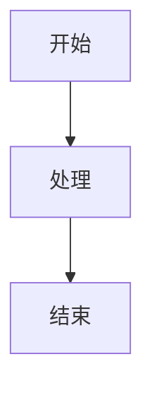
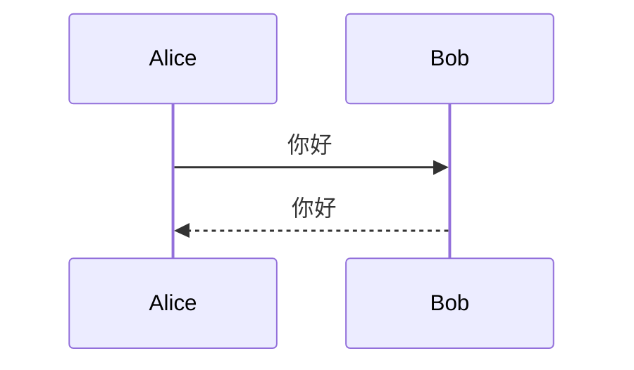
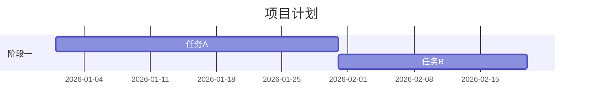
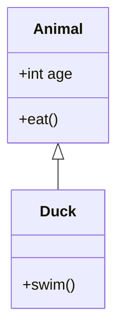
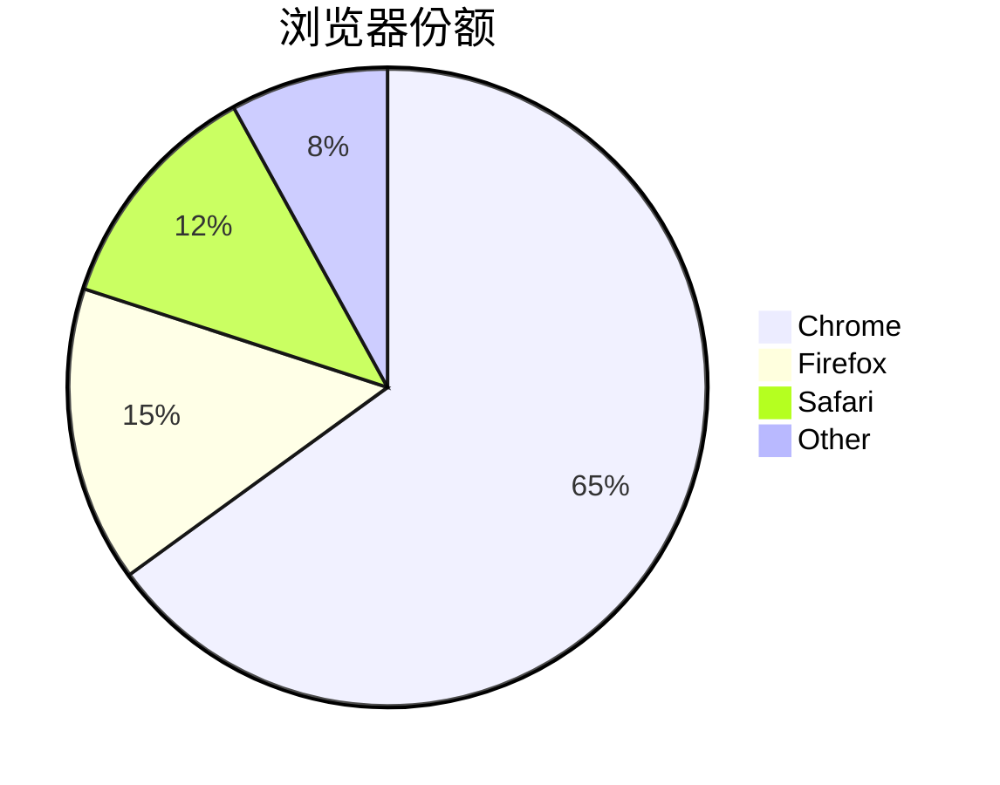

# Markdown 语法支持

本文档列出 omd 两个版本支持的 Markdown 语法和扩展特性。

## 标准 Markdown

### 标题

```markdown
# 一级标题
## 二级标题
### 三级标题
#### 四级标题
##### 五级标题
###### 六级标题
```

| 桌面版 | Web 版 |
|--------|--------|
| ✅ 字号递减 + 加粗 | ✅ HTML `<h1>`–`<h6>` |

### 段落与换行

```markdown
这是第一段。

这是第二段（中间空行分隔）。

行末两个空格 + 回车  
可强制换行。
```

### 强调

```markdown
**粗体文字**
*斜体文字*
***粗斜体***
~~删除线~~
```

| 语法 | 桌面版 | Web 版 |
|------|--------|--------|
| `**粗体**` | ✅ | ✅ |
| `*斜体*` | ✅ | ✅ |
| `~~删除线~~` | ✅ | ✅ |

### 行内代码

```markdown
使用 `println!()` 输出文字。
```

### 代码块

````markdown
```rust
fn main() {
    println!("Hello!");
}
```
````

| 特性 | 桌面版 | Web 版 |
|------|--------|--------|
| 围栏代码块 | ✅ 等宽字体 + 背景色 | ✅ `<pre><code>` |
| 缩进代码块 | ✅ | ✅ |
| 语法高亮 | ❌ | ❌ |
| 语言标记 | 识别但不着色 | 识别但不着色 |

### 链接

```markdown
[链接文字](https://example.com)
[带标题的链接](https://example.com "悬停标题")
<https://example.com>
```

| 桌面版 | Web 版 |
|--------|--------|
| ✅ 可点击超链接 | ✅ 可点击超链接 |

### 图片

```markdown


```

| 特性 | 桌面版 | Web 版 |
|------|--------|--------|
| 网络图片 | ✅ | ✅ |
| 本地路径 | ✅ 相对/绝对路径 | ✅（需可访问） |
| Base64 图片 | ✅ `data:image/...` | ✅ |
| SVG | ✅ | ✅ |
| 图片标题 | ❌ 仅显示 alt | ✅ HTML title 属性 |

### 列表

#### 无序列表

```markdown
- 项目 A
- 项目 B
  - 嵌套项目
* 也可用星号
+ 或加号
```

#### 有序列表

```markdown
1. 第一项
2. 第二项
3. 第三项
```

| 桌面版 | Web 版 |
|--------|--------|
| ✅ `•` 或 `1.` 前缀 | ✅ HTML `<ul>` / `<ol>` |

### 引用

```markdown
> 这是一段引用文字。
> 可以多行。
>
> > 嵌套引用
```

### 分隔线

```markdown
---
***
___
```

## GFM 扩展（GitHub Flavored Markdown）

通过 pulldown-cmark 的 Options 启用。

### 表格

```markdown
| 列1 | 列2 | 列3 |
|-----|:---:|----:|
| 左对齐 | 居中 | 右对齐 |
| 数据 | 数据 | 数据 |
```

| 桌面版 | Web 版 |
|--------|--------|
| ✅ egui::Grid 条纹表格 | ✅ HTML `<table>` 条纹样式 |

### 任务列表

```markdown
- [x] 已完成任务
- [ ] 未完成任务
- [x] ~~已完成并删除线~~
```

| 桌面版 | Web 版 |
|--------|--------|
| ✅ ☑/☐ 文本显示 | ✅ HTML 复选框（不可交互） |

### 删除线

```markdown
~~被删除的文字~~
```

已在标准强调中列出，GFM 正式支持。

## Mermaid 图表（Web 版）

> 仅 Web 版支持。桌面版不渲染 Mermaid 代码块。

### 流程图

````markdown

````

### 时序图

````markdown

````

### 甘特图

````markdown

````

### 类图

````markdown

````

### 饼图

````markdown

````

完整 Mermaid 语法参考：[Mermaid 官方文档](https://mermaid.js.org/intro/)

## 不支持的语法

以下 Markdown 扩展**暂不支持**：

| 语法 | 说明 |
|------|------|
| LaTeX 数学公式 | `$E=mc^2$` 不渲染 |
| 脚注 | `[^1]` 语法忽略 |
| 定义列表 | HTML `<dl>` 不支持 |
| 缩写 | `<abbr>` 不支持 |
| 高亮标记 | `==高亮==` 不支持 |
| HTML 内嵌 | 部分解析为纯文本 |
| Wiki 链接 | `[[page]]` 不支持 |
| YAML Front Matter | 不解析元数据 |
| 目录生成 | 无自动 TOC |
| 表情符号简写 | `:smile:` 不转换 |

## 最佳实践

### 图片

- **Web 版**：小图用 Base64 嵌入，大图用 URL 引用
- **桌面版**：使用相对路径引用同目录图片
- 始终填写有意义的 alt 文字

### 表格

- 表头与分隔行之间不要空行
- 列数保持一致
- 复杂表格考虑用 HTML（Web 版部分支持）

### Mermaid

- 节点文字避免特殊字符
- 复杂图表分拆为多个小图
- 使用 `flowchart TD`（上下）或 `flowchart LR`（左右）控制方向

### 代码块

- 始终标注语言：` ```rust ` 而非 ` ``` `
- 长代码块考虑折叠或外链

## 相关文档

- [用户指南](user-guide.md)
- [桌面版指南](desktop.md)
- [Web 版指南](web.md)
