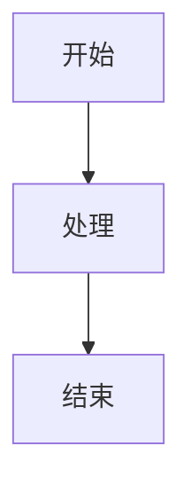

# 用户指南

omd 是一款用 Rust 编写的轻量级 Markdown 编辑器，提供**桌面版**、**Web 版**和 **Android 版**，满足不同使用场景。

## 版本选择

| 特性 | 桌面版 | Web 版 | Android 版 |
|------|--------|--------|------------|
| 运行环境 | 本地电脑（Windows/macOS/Linux） | 任意现代浏览器 | Android 8.0+ 手机/平板 |
| 安装 | 需编译或下载二进制 | 无需安装，打开即用 | 安装 APK |
| 文件管理 | 原生文件对话框，直接读写磁盘 | 导入/下载 `.md` 文件 | 系统文件关联打开 `.md` |
| 自动保存 | ✅ 可配置写入磁盘 | localStorage + IndexedDB | localStorage + IndexedDB |
| 导出 HTML | ✅ | ✅ | — |
| 在线使用 | — | [omd Web](https://doshall.github.io/omd/) | — |
| Mermaid 图表 | ✅ | ✅ | ✅ |
| 图片粘贴 | ✅ `Ctrl+V` | ✅ 粘贴/拖拽 | ✅ 粘贴/上传 |
| 手机使用 | ❌ | ✅ 响应式布局 | ✅ 原生 APK |
| 离线使用 | ✅ | 部署后可离线 | ✅ 完全离线 |

**推荐：**
- 日常写作、本地文件管理 → **桌面版**
- 手机离线使用 → **Android 版**（推荐）
- 浏览器快速预览、无需安装 → **Web 版**（[在线体验](https://doshall.github.io/omd/)）

## 界面概览

三个版本共享相似的界面布局：

```
┌─────────────────────────────────────────────┐
│  菜单栏 / 顶部操作区（新建、打开、保存、主题）  │
├─────────────────────────────────────────────┤
│  工具栏（B I S 代码 链接 图片 标题 列表 …）    │
├──────────────────┬──────────────────────────┤
│                  │                          │
│    编辑区         │       预览区              │
│  （Markdown 源码）│   （渲染后的效果）         │
│                  │                          │
├──────────────────┴──────────────────────────┤
│  状态栏（行数 · 字数 · 字符数 · 文件信息）    │
└─────────────────────────────────────────────┘
```

## 通用功能

### 实时预览

在编辑区输入 Markdown 源码，预览区即时渲染。无需手动刷新。

### 文本格式化

通过工具栏按钮快速插入格式：

| 按钮 | 功能 | 生成语法 |
|------|------|----------|
| **B** | 粗体 | `**文字**` |
| **I** | 斜体 | `*文字*` |
| **S** | 删除线 | `~~文字~~` |
| **</>** | 行内代码 | `` `代码` `` |
| **🔗** | 链接 | `[文字](url)` |
| **H / H1 H2** | 标题 | `# 标题` |
| **•** | 无序列表 | `- 项目` |
| **❝** | 引用 | `> 引用文字` |

> 选中文字后点击格式按钮，会在选中内容两侧插入标记。

### 主题切换

点击 **🌙** / **☀️** 在深色和浅色主题间切换。Web 版的 Mermaid 图表会同步适配主题。

### 状态栏

底部状态栏实时显示：

- **行数**：文档总行数
- **字数**：按空白分隔的单词/词数
- **字符数**：Unicode 字符总数
- **文件信息**：当前文件名或路径

## 文件操作

### 桌面版

| 操作 | 菜单 | 工具栏 | 快捷键 |
|------|------|--------|--------|
| 新建 | File → New | 📄 New | `Ctrl+N` |
| 打开 | File → Open | 📂 Open | `Ctrl+O` |
| 保存 | File → Save | 💾 Save | `Ctrl+S` |
| 另存为 | File → Save As | 💾 Save As | `Ctrl+Shift+S` |

支持文件格式：`.md`、`.markdown`、`.txt`

窗口标题中的 `*` 表示文件有未保存的修改。

### Web 版

| 操作 | 按钮 | 说明 |
|------|------|------|
| 新建 | 新建 | 清空编辑区 |
| 打开 | 打开 | 从本地选择 `.md` 文件导入 |
| 下载 | 下载 | 将当前内容保存为 `.md` 文件 |

Web 版会**自动保存**编辑内容到浏览器（localStorage / IndexedDB），刷新页面后自动恢复。支持**多标签页**与**最近文件**栏（点击可重新打开已打开过的文档）。

### Android 版

| 操作 | 说明 |
|------|------|
| 打开文件 | 从文件管理器点击 `.md` 文件，或通过应用内「打开」 |
| 自动保存 | 内容自动保存到 localStorage，重启应用后恢复 |
| 上传图片 | 使用系统文件选择器 |

Android 版功能与 Web 版一致（Mermaid、图片粘贴、三种视图模式），详见 [Android 版指南](android.md)。

## 图片

### 桌面版

1. 点击工具栏 **🖼**
2. 选择本地图片文件（PNG、JPG、GIF、WebP、SVG、BMP）
3. 自动插入 `` 并在预览区显示

也支持在 Markdown 中手写网络图片：``

### Web 版

| 方式 | 操作 |
|------|------|
| URL | 点击 **🌐**，输入图片地址 |
| 上传 | 点击 **🖼**，从相册/文件选择 |
| 粘贴 | 在编辑区 `Ctrl+V` 粘贴截图 |
| 拖拽 | 将图片文件拖入编辑区 |

上传的图片会转为 Base64 嵌入 Markdown，文档可独立分享，但文件体积会增大。

## 图表（Web / Android 版）

使用 Mermaid 语法创建流程图、时序图等：

````markdown

````

详见 [Markdown 语法支持](markdown-syntax.md#mermaid-图表web-版)。

## 视图模式（Web / Android 版）

| 按钮 | 模式 | 适用场景 |
|------|------|----------|
| ⊞ | 分栏 | 宽屏，边写边看 |
| ✎ | 仅编辑 | 手机竖屏，专注写作 |
| 👁 | 仅预览 | 阅读成品 |

## 快速参考卡

### 工具栏按钮

| 按钮 | 效果 | Markdown 语法 |
|------|------|---------------|
| B | 粗体 | `**文字**` |
| I | 斜体 | `*文字*` |
| S | 删除线 | `~~文字~~` |
| </> | 行内代码 | `` `代码` `` |
| 🔗 | 链接 | `[文字](url)` |
| 🖼 | 插入图片 | `` |
| H / H1 H2 | 标题 | `# 标题` |
| • | 无序列表 | `- 项目` |
| ❝ | 引用 | `> 引用` |

### 快捷键（桌面版）

| 快捷键 | 功能 |
|--------|------|
| `Ctrl+N` | 新建 |
| `Ctrl+O` | 打开 |
| `Ctrl+S` | 保存 |
| `Ctrl+Shift+S` | 另存为 |

### Web 版视图按钮

| 按钮 | 模式 |
|------|------|
| ⊞ | 分栏（编辑+预览） |
| ✎ | 仅编辑 |
| 👁 | 仅预览 |

## 下一步

- 桌面版详细说明 → [桌面版指南](desktop.md)
- Web 版详细说明 → [Web 版指南](web.md)
- Android 版详细说明 → [Android 版指南](android.md)
- 三版本功能对比 → [版本功能对比](comparison.md)
- Markdown 语法参考 → [Markdown 语法支持](markdown-syntax.md)
- 遇到问题 → [常见问题](faq.md)
