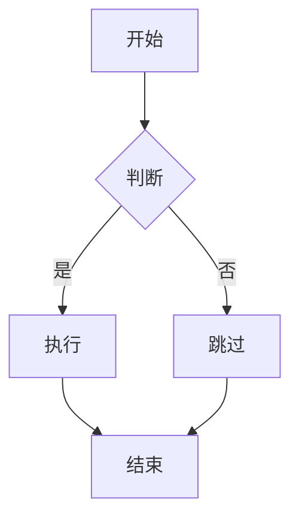
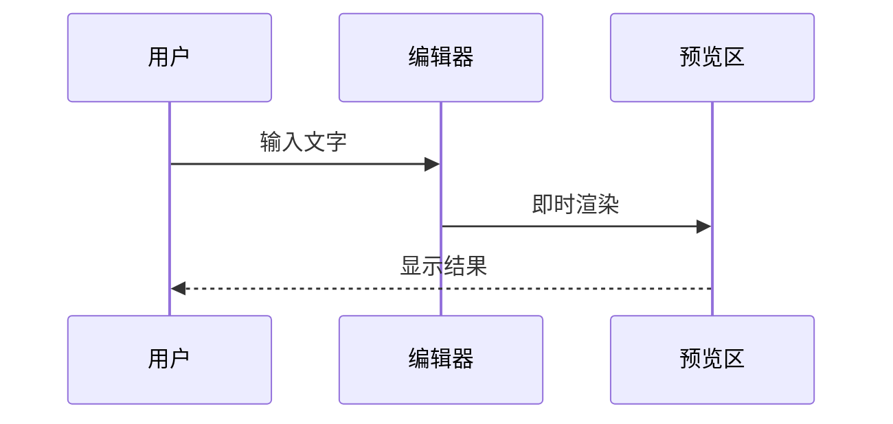

# Web 版指南

omd Web 版是基于 **Leptos + WebAssembly** 的浏览器 Markdown 编辑器，可在电脑、手机、平板浏览器中使用，无需安装。

## 系统要求

- 现代浏览器：Chrome 90+、Firefox 90+、Safari 15+、Edge 90+
- 启用 JavaScript 和 WebAssembly
- 启用 localStorage（用于自动保存）

## 快速开始

### 本地运行

```bash
# 首次需要安装工具
cargo install trunk --locked
rustup target add wasm32-unknown-unknown

# 启动开发服务器
cd web
trunk serve

# 浏览器打开 http://127.0.0.1:8080
```

### 手机访问

确保手机和电脑在同一局域网，用手机浏览器访问：

```
http://<电脑IP>:8080
```

例如 `http://192.168.1.100:8080`

## 界面详解

### 顶部操作区

| 按钮 | 功能 |
|------|------|
| **新建** | 清空编辑区，重置为空白文档 |
| **打开** | 从本地选择 `.md` / `.markdown` / `.txt` 文件导入 |
| **下载** | 将当前内容保存为 `.md` 文件到本地 |
| **🌙 / ☀️** | 切换深色/浅色主题 |

### 工具栏

```
B | I | S | </> | 🔗 | 🖼 | 🌐 | H | • | ❝ | ⊞ | ✎ | 👁
```

| 按钮 | 功能 |
|------|------|
| B / I / S / </> / 🔗 | 文本格式化（同桌面版） |
| 🖼 | 从相册/文件选择图片上传 |
| 🌐 | 输入图片 URL 插入 |
| H | 行首插入 `# ` 标题 |
| • | 行首插入 `- ` 列表 |
| ❝ | 行首插入 `> ` 引用 |
| ⊞ | 分栏模式（编辑+预览） |
| ✎ | 仅编辑模式 |
| 👁 | 仅预览模式 |

### 编辑区

- 等宽字体，支持多行输入
- 左侧 **行号栏**：显示行号，光标所在行高亮
- 右侧 **Minimap** 缩略条：色块标示文档结构，点击或拖拽快速滚动
- **查找 / 替换**：`Ctrl+F` / `Ctrl+H` 打开查找栏，支持区分大小写、全部替换
- 支持粘贴图片（`Ctrl+V` / 长按粘贴）
- 支持拖拽图片文件到编辑区
- 占位提示：`在此输入 Markdown，可粘贴或拖入图片...`

### 预览区

- HTML 渲染（via pulldown-cmark）
- 支持图片、表格、代码块、Mermaid 图表
- 自适应宽度，图片自动缩放

### 状态栏

```
行 42 · 字 256 · 字符 1024    document.md · 已自动保存
```

## 自动保存

Web 版通过 **localStorage** 自动保存以下内容：

| 键名 | 内容 |
|------|------|
| `omd-web-content` | 编辑区 Markdown 文本 |
| `omd-web-theme` | 主题偏好（`dark` / `light`） |
| `omd-web-view` | 视图模式（`split` / `editor` / `preview`） |

- 每次编辑后自动保存
- 刷新页面后自动恢复
- 状态栏短暂显示「已自动保存」提示

### 清除保存的数据

浏览器开发者工具 → Application → Local Storage → 删除 `omd-web-*` 键，或点击「新建」后手动清除。

### 存储限制

localStorage 通常限制 5–10 MB。大量 Base64 图片可能导致存储满。建议：

- 大文档使用 URL 图片而非上传
- 定期下载备份 `.md` 文件

## 图片功能

### 四种插入方式

#### 1. URL 插入（🌐）

1. 点击工具栏 **🌐**
2. 在弹窗中输入图片 URL
3. 插入 ``

适合引用网络上的图片。

#### 2. 文件上传（🖼）

1. 点击工具栏 **🖼**
2. 选择本地图片文件
3. 自动转为 Base64 嵌入：``

适合离线文档或需要自包含的场景。

#### 3. 粘贴截图

1. 截图到剪贴板（如 `PrtSc`、`Win+Shift+S`）
2. 在编辑区 `Ctrl+V`（Mac：`Cmd+V`）
3. 自动插入 Base64 图片

手机：长按 → 粘贴。

#### 4. 拖拽

将图片文件从文件管理器拖入编辑区，自动上传为 Base64。

### 预览效果

- 图片最大宽度 100%，自适应容器
- 圆角边框和阴影
- 支持 SVG、PNG、JPG、GIF、WebP

## Mermaid 图表

Web 版集成 [Mermaid.js](https://mermaid.js.org/) 渲染图表。

### 流程图

````markdown

````

### 时序图

````markdown

````

### 其他图表类型

Mermaid 还支持：甘特图、饼图、类图、状态图、ER 图等。详见 [Mermaid 官方文档](https://mermaid.js.org/intro/)。

### 主题适配

切换深色/浅色主题时，Mermaid 图表自动切换 `dark` / `default` 主题。

## 视图模式

### 分栏模式（⊞）

默认模式。左侧编辑，右侧预览。宽屏最佳。

### 仅编辑（✎）

隐藏预览区，编辑区占满屏幕。适合手机竖屏写作。

### 仅预览（👁）

隐藏编辑区，预览区占满屏幕。适合阅读成品。

### 移动端布局

屏幕宽度 ≤ 768px 时：

- 编辑区和预览区**上下排列**（各约 40vh）
- 工具栏按钮略微放大，便于触摸
- 最小触摸目标 36px

## 文件操作

### 打开文件

1. 点击「打开」
2. 选择 `.md` / `.markdown` / `.txt` 文件
3. 内容加载到编辑区，文件名显示在状态栏

### 下载文件

1. 点击「下载」
2. 浏览器下载当前内容为 `.md` 文件
3. 默认文件名 `document.md`

### 新建文件

点击「新建」清空编辑区。自动保存的内容也会被覆盖。

## 构建与发布

### 开发构建

```bash
cd web
trunk serve
```

- 默认监听 `0.0.0.0:8080`
- 支持热重载（修改 Rust/CSS/HTML 后自动重建）

### 发布构建

```bash
cd web
trunk build --release
```

输出目录：`web/dist/`

```
dist/
├── index.html
├── omd-web-<hash>.js
├── omd-web-<hash>_bg.wasm
└── style-<hash>.css
```

部署到任意静态文件服务器即可。详见 [部署指南](deployment.md)。

## 已知限制

- 无多标签页
- 代码块无语法高亮
- 不支持 LaTeX 数学公式
- localStorage 有容量限制
- 需要网络加载 Mermaid.js CDN（可改为本地托管）
- 预览区任务列表不可点击切换

## 故障排除

### 页面空白

- 检查浏览器控制台是否有 WASM 加载错误
- 确认浏览器支持 WebAssembly
- 尝试 `trunk build` 重新构建

### Mermaid 图表不显示

- 确认代码块语言标记为 `mermaid`
- 检查网络能否访问 CDN（`cdn.jsdelivr.net`）
- 打开浏览器控制台查看 Mermaid 渲染错误

### 自动保存不工作

- 检查浏览器是否禁用了 localStorage
- 隐私/无痕模式可能限制存储
- 存储满时无法继续保存

### `trunk` 命令报错

```bash
# NO_COLOR 环境变量冲突时
env -u NO_COLOR trunk serve
```

## 相关文档

- [用户指南](user-guide.md)
- [部署指南](deployment.md)
- [Markdown 语法支持](markdown-syntax.md)
- [常见问题](faq.md)
